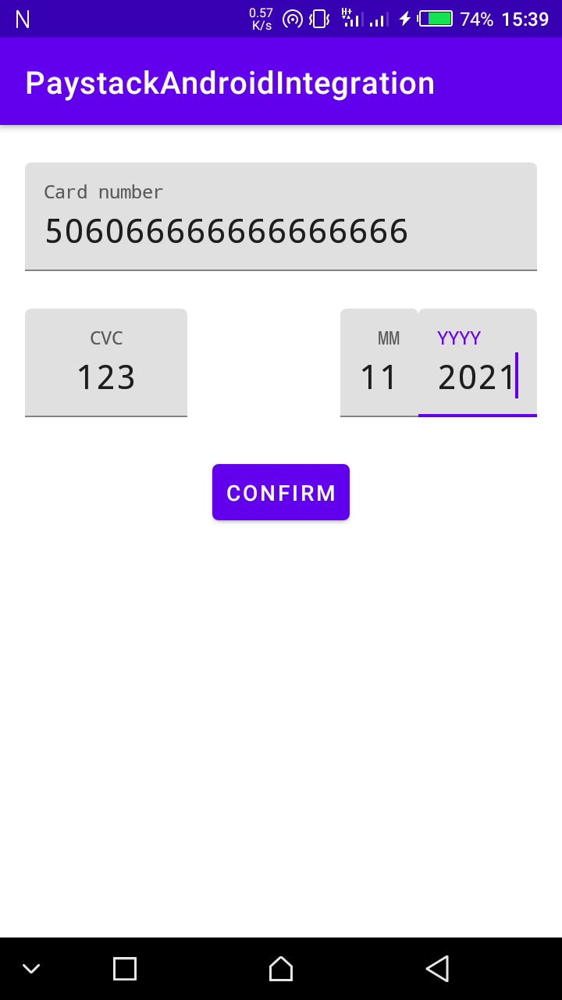
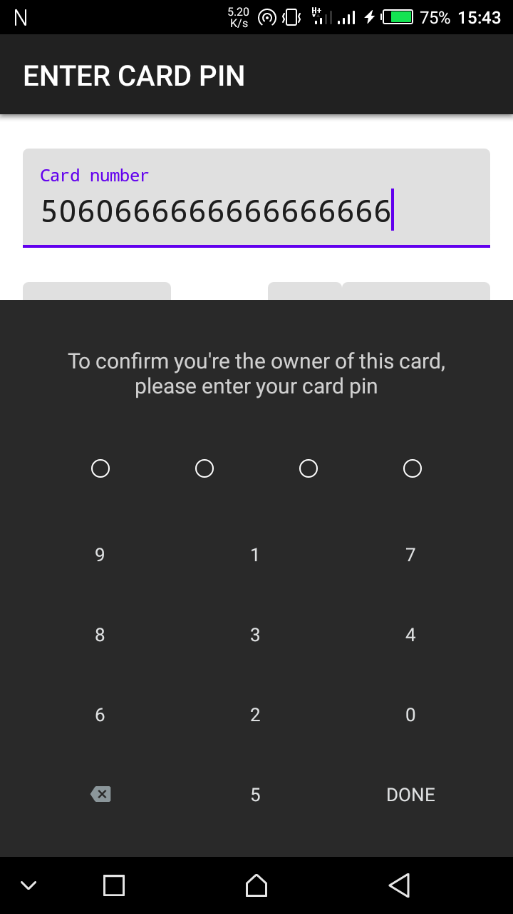
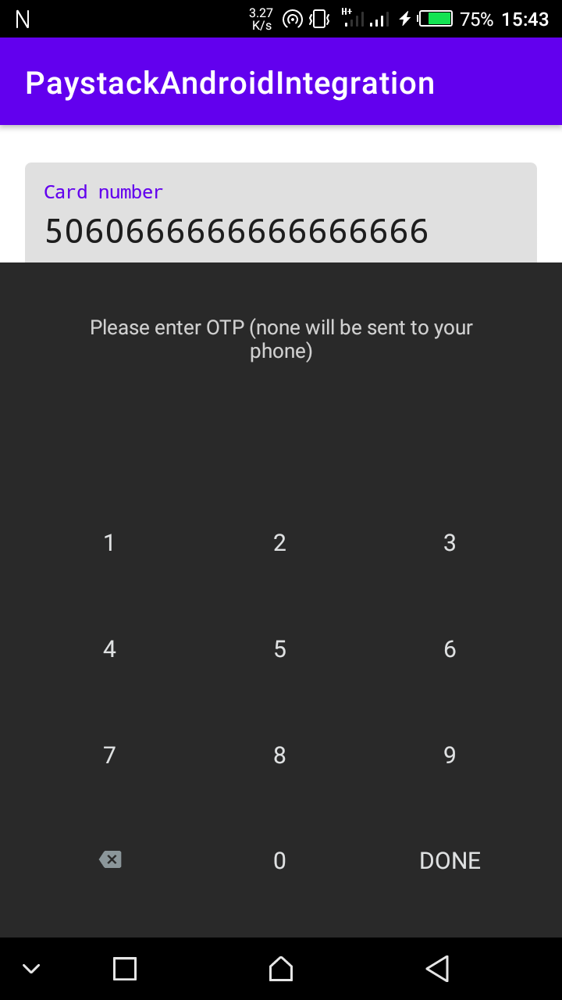

# PaystackAndroidIntegration

I wrote an article on how to integrate Paystack in your app, 
click [here](https://dev.to/ayevbeosa/using-paystack-in-your-android-application-2oee) to get started.

### Prerequisites
* Kotlin 1.3.71 or later
* Android Studio 3.6.3 or later

### Installation
* Start up your terminal (or Command Prompt on Windows OS).
* Fork this repository or clone it using 
```
git clone https://github.com/Iyamu-J/PaystackAndroidIntegration.git
```
* Startup your Android Studio.
* In Android Studio, go to File -> New -> Import project.
* Navigate to the project directory and follow the instructions on the dialog wizard to import the project.
* Add your public key in `MainActivity.kt` and `AndroidManifest.xml`
* Once you are done and all is fully set, you can run the app.

### Screenshots


